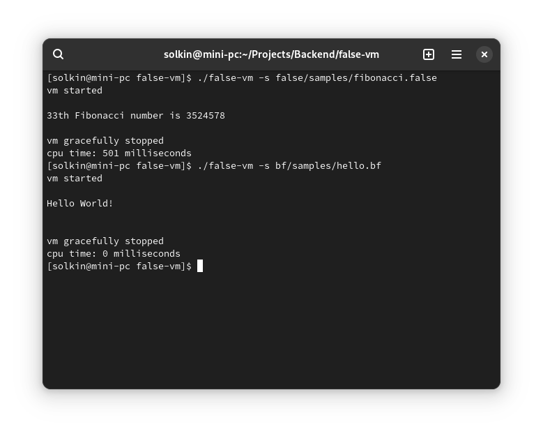

# False-VM
Virtual Machine + False and Brainfuck compilers



Build instructions
------------------

Requirements:

* Go 1.11+

Assuming you have it, type:

```
go build
```

This will produce `false-vm` executable in the project folder.

Usage
------------------

Run false-vm with `-help` to get all flags info:

```
./false-vm -help

Usage of ./false-vm:
  -b string
    	bytecode file (has more priority than source file parameter)
  -cs int
    	call stack size (part of total memory; 32-bit integers) (default 640)
  -l string
    	force set language: auto (autodetect by file extension), false - FALSE, bf - Brainfuck (default "auto")
  -m int
    	total memory size (32-bit integers) (default 131072)
  -o string
    	output compiled bytecode to file
  -os int
    	operation stack size (part of total memory; 32-bit integers) (default 1280)
  -r	run compiled file (default true)
  -s string
    	source file (.bf and .false are supported)
  -v	verbose log mode
```

To compile and run Fibonacci sample:

```
./false-vm -s false/samples/fibonacci.false
```

This will compile Fibonacci sample to bytecode file without running:

```
./false-vm -s false/samples/fibonacci.false -o fib.fbc -r false
```

and when you need to run, just type:

```
./false-vm -b fib.fbc
```
